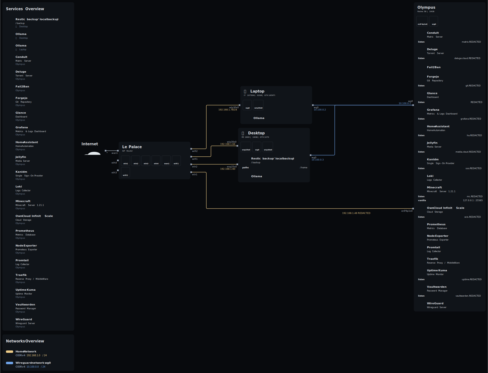

# My Ecosystem

In this repository you will find the configuration I daily-drive on my 3 machine + my smartphone.

# Topology

This is the topology of my network. Using [nix-topology](https://github.com/oddlama/nix-topology)



# What does it include ?

This configuration cover an ARM Server, a X86-64 Desktop, a X86-64 laptop and an ARM Smarphone (through [Nix-On-Droid](https://github.com/nix-community/nix-on-droid)).

- Fully decalrative Network configuration.
- Secrets managed with [sops-nix](https://github.com/Mic92/sops-nix).
- Neovim configuration with [NVF](https://github.com/NotAShelf/nvf)
- Separated Home-Manager
- Centralized Theming with [Stylix](https://github.com/danth/stylix)
- Modularized Configuration


# Install

Disable secureboot
```sh
```
